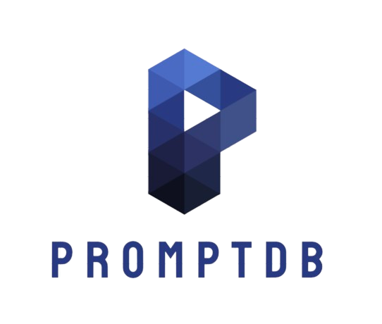

# AI-based Natural Language Prompt to SQL Generator

Effortlessly convert natural language prompts into SQL queries using state-of-the-art AI and NLP techniques.

## Key Features
- **NLP Processing:** Understands and processes user inputs to generate accurate SQL statements.
- **Deep Learning Frameworks:** Utilizes advanced transformer models like the Gemini model.
- **SQL Management:** Supports various relational databases (MySQL, PostgreSQL).
- **Data Preprocessing:** Includes robust cleaning and tokenization techniques.
- **Scalable Deployment:** Compatible with cloud platforms such as AWS, Azure, and Google Cloud.
- **LLM API Integration:** Enhances language understanding and query generation using large language model APIs.
